# ML-Assignment2: IEEE-CIS Fraud Detection

## პროექტის სათაური

Kaggle IEEE-CIS Fraud Detection 

## Kaggle-ის კონკურსის მოკლე მიმოხილვა

კონკურსის მიზანია თითოეული ტრანზაქციისთვის `isFraud` კლასის, ანუ სიყალბის პროგნოზირება. ამოცანაში მოცემული დატა არის საკმაოდ დაუბალანსებელი, რადგან ცოტაა ყალბი ტრანზაქციების პროცენტულობა და ამ competition-ის მთავარი მეტრიკა არის ROC-AUC.  

## ჩემი მიდგომა პრობლემის გადასაჭრელად

დაკვირვებიდან ჩანს, რომ მხოლოდ 3.50% არის target ში true და ჩემი მთავარი იდეა იყო, რომ დაუბალანსებელ დატასთან მის შესაბამისად მემუშავა და არ ამერჩია ისეთი მოდელები, რომლებსაც მსგავს დატასთან მუშაობა უჭირს. ვცადე 5 სხვადასხვა მოდელის არქიტექტურა, XGBoost, RandomForest, DecisionTree, CatBoost და LightGBM.

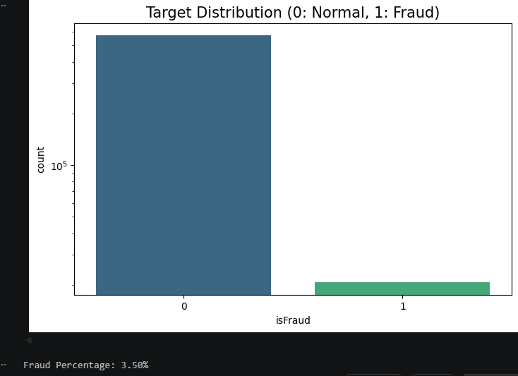

## რეპოზიტორიის სტრუქტურა

ML-Assignment2/
├── model-experiment-randomforest.ipynb
├── model_experiment_DecisionTree.ipynb
├── model_experiment_CatBoost.ipynb
├── model-experiment-xgboost.ipynb
├── model_experiment_LGBM.ipynb
└── README.md

## ყველა ფაილის განმარტება

- `model-experiment-randomforest.ipynb` — pipeline RandomForest მოდელის pipeline.
- `model_experiment_DecisionTree.ipynb` — Decision Tree pipeline (baseline + tuning).
- `model_experiment_CatBoost.ipynb` — CatBoost pipeline 
- `model-experiment-xgboost.ipynb` — XGBoost pipeline 
- `model_experiment_LGBM.ipynb` — LightGBM pipeline
- `README.md` — პროექტის დოკუმენტაცია.

## FEATURE ENGINEERING

**თავიდან ყველაფერი დავიწყე დატას სიღრმისეული ანალიზით, როგორც ვიცი EDA-ს ეძახიან. რა სვეტებზეც შემეძლო და გამოკვეთილი იყო ვინაობა, გამოვიკვლიე, მაგალითად: TransactionDT, TransactionAmt,	ProductCD, DeviceType,	DeviceInfo და შედეგად მოდელისთვის გამოსადეგი ახალი feature-ებიც მივიღე**

**რაც გავლილი გვაქვს, თითქმის ყველაფერი ვცადე. ერთადერთი არ ვცადე RFE, რადგან ამხელა დატაზე წარმოუდგენელი იქნებოდა RFE-ს გამოყენება.**

Feature engineering და preprocessing pipeline :

- Train დატაში id სვეტების: `-` → `_`.
- Memory reduction (`reduce_mem_usage`) downcast-ებით.
- outlier removal: `TransactionAmt > 30000` მოცილება (მხოლოდ train-ში).
 
 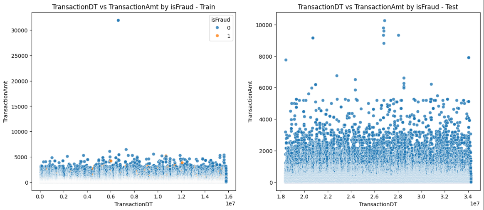

- TransactionDT იყო ერთ-ერთი მნიშვნელოვანი სვეტი, რადგან გვეუბნება როგორ იქცევა კლიენტი დროში. სვეტიდან გამოვყავი დროითი feature-ები, რომლებიც აქამდე არ გვქონდა: `day`, `hour`, `hour_alertFeature`.
ასევე ამ სვეტიდან ვცადე ყველაზე frequency დღეები მეპოვა, როცა თაღლითობა ხდება, მაგრამ დღეების მიმართ თითქმის თანაბარგანაწილებული იყო სიხშირე. 

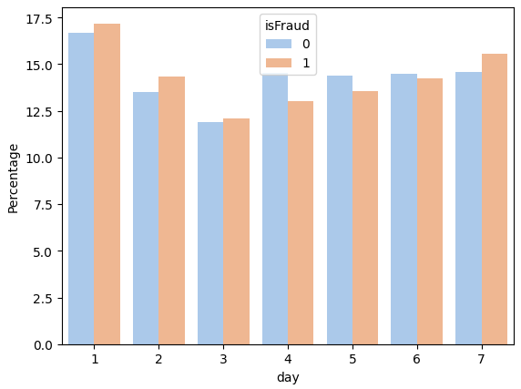

მაგრამ, სამაგიეროდ საათების მიმართ არ იყო თანაბრადგანაწილებული და ძალიან კარგი feature მივიღე hour_alertFeature, რომელიც გვეუბნება ყველაზე სახიფათო და მოსალოდნელი როდის არის თაღლითობა. highalert, mediumalert, lowalert და noalert ად დავყავი დროები და ამის შედეგად მივიღე ეს სვეტი.

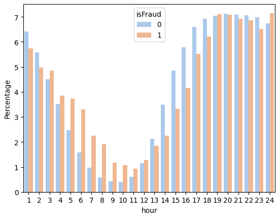

- ტრანზაქციის სიდიდის feature: `TransactionAmt_to_mean_card1`.
გვეხმარება იმ სიტუაციაში, როცა კონკრეტული მონაცემისთვის საეჭვოდ მოიმატა ტრანზაქციის სიდიდემ, ანუ ფულის რაოდენობა.

## კატეგორიული ცვლადების რიცხვითში გადაყვანა

> გამოყენებული encoding მიდგომები:

- **WOE & IV** — გამოვიყენე ისეთი დიდი სიხშირის სვეტებისთვის, რომლებზეც მეგონა, რომ მნიშვნელოვანი იქნებოდა ტრენინგისას, მაგალითად P_emaildomain, R_emaildomain, DeviceInfo.
- **One-Hot Encoding** — მონაცემი დაბალი სიხშირის მნიშვნელობის სვეტებისთვის (`nunique <= 5`), რათა კატეგორიული ცვლადები ისე მოვიშოროთ, რომ დატაც ძალიან არ გავზარდოთ. 
- **Frequency Encoding** — შესაძლო Sus სვეტებში კატეგორიული მონაცემები შევცვალე ამ მონაცემების სიხშირით, ეს რორამე სასარგებლოა, რადგან fraud detection-ში იშვიათად გამოჩენილი ნომერი ან email  შეიძლება მიუთითებდეს თაღლითობაზე..
- **Label Encoding** — მონაცემის მაღალი სიხშირის სვეტებისთვის (`nunique > 5`), რომლებზე OHE-ც ძალიან გაგვიდიდებდა დატას.

## NAN მნიშვნელობების დამუშავება

- RandomForest / Decision Tree / CatBoost pipeline-ებში გამოვიყენე median imputation (train-ზე დათვლილი).
- XGBoost / LightGBM pipeline-ებში გამოვიყენე NaN შევავსე -999-ით, რადგან ვიცოდი, რომ ეს მოდელები თვითონ მუშაობდნენ NaN-ს პრობლემაზე.

## CLEANING მიდგომები

- Kaggle-ს დატას გაერთიანება: `train_transaction` + `train_identity`.
- `TransactionID`-ს ამოღება დატადან, რადგან არანაირი მნიშვნელობის მატარებელი არ არის ID მოდელისთვის.
- outlier removal: `TransactionAmt > 30000` მოცილება (მხოლოდ train-ში).
- Train დატაში id სვეტების: `-` → `_`

## FEATURE SELECTION

- **Correlation Filter** — `C*` და `D*` სვეტებში მაღალი კორელაციის სვეტების მოცილება (`> 0.95`).
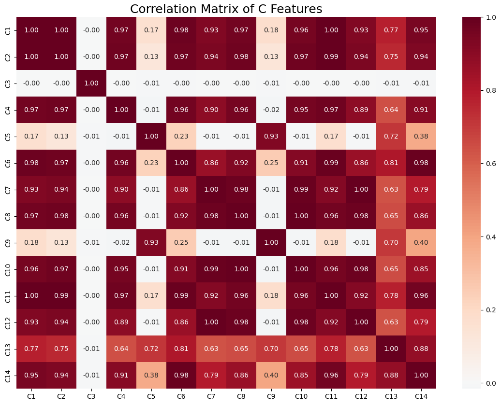

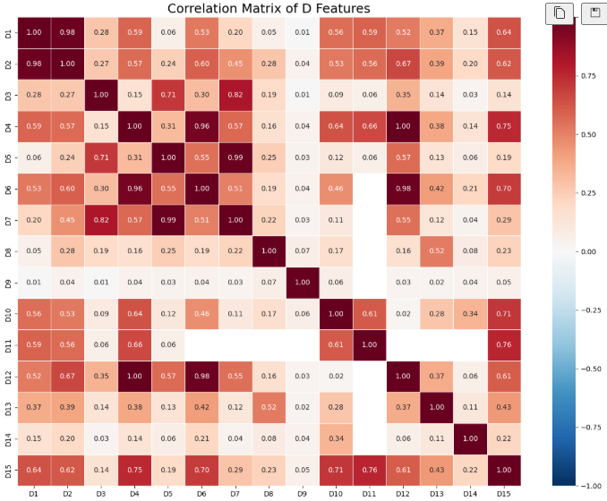

*D სვეტების target-თან კორელაცია*

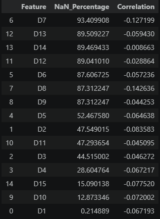

- **LGBM importance** — ვინაიდან და რადგანაც V სვეტების ძალიან დიდი რაოდენობა გვქონდა დატაში ( 339 ), გადავწყვიტე, რომ LightGBM-ს feature importance-ები გამომეყენებინა, რადგან ვიცოდი რომ სწრაფად მუშაობა და შედეგად 399 V სვეტიდან 119 უმნიშვნელო სვეტი წავშალეთ.
- **WOE & IV** — კატეგორიული სვეტებში ფასეული/უაზრო ინფორმაციის მომცემი სვეტების დახარისხება target-aware encoding-ით.
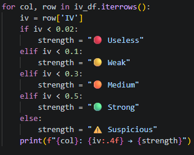

- **SHAP** — მოდელის გაშვების შემდეგ გადამოწმება სვეტების მნიშვნელობის.
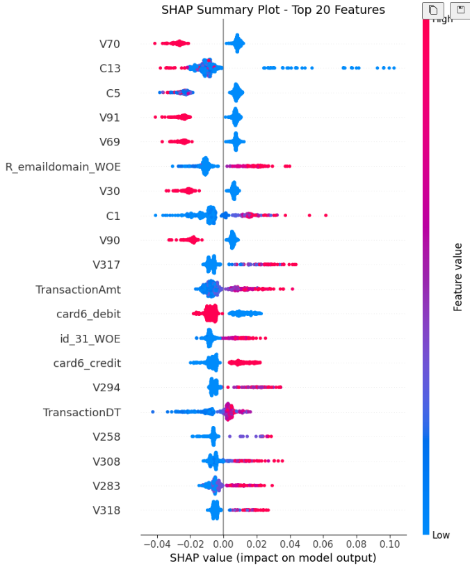

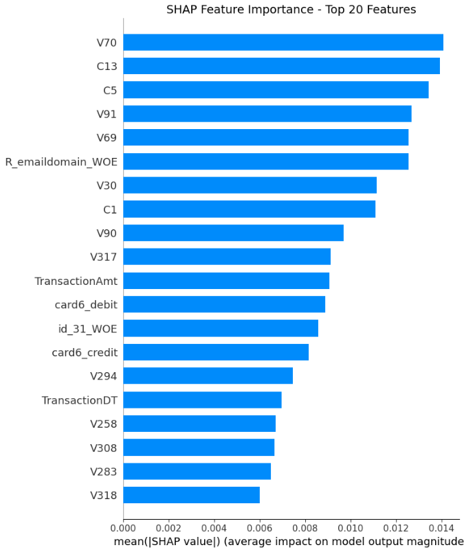

- **One-Hot / Frequency / Label Encoding** — უკვე ვისაუბრე.

## გამოყენებული მიდგომები და მათი შეფასება

ძალიან დიდი დატაა ძალიან ბევრი სვეტით, რომ ყველაფერი ზუსტად და ხარისხიანად ვქნათ, მაგრამ ნასწავლი მეთოდების გამოყენებით შეძლების და გვარად დავამუშავე დატა. დიდი დატა რომ არ ყოფილიყო, RFE-ს გამოყენებასაც შევძლებდი და უფრო ხარისხიანად ვიმუშავებდი Feature Engineering & Selection-ზე.

## TRAINING

### ტესტირებული მოდელები

- XGBoost
- RandomForest
- Decision Tree
- CatBoost
- LightGBM

**უფრო ვრცლად MLflow ექსპერიმენტის ბმულებთან ვილაპარაკებ მოდელებზე.**

### Hyperparameter ოპტიმიზაციის მიდგომა

- ჩემი გამოყენებული მეტრიკების გამო ცოტა რთული იყო "ყველაზე სწორი" ჰიპერპარამეტრის შერჩევა, რადგან ერთი მნიშვნელოვანი მეტრიკის უკეთესობისკენ გაზრდა, საპასუხოდ იწევდა მეორე მნიშვნელოვანი მეტრიკის უარესობისკენ შემცირებას. ამაზე უფრო ვრცლად MLflow tracking-ის სექციაში ვისაუბრებ.
- იტერაციებით/ხელით tuning MLflow ექსპერიმენტებით;
- train/validation-ს output ების მიხედვით მოდელის კომპლექსურობის მომატება/დაკლება. თუ overfit გვაქვს train-validation-ში, მაშინ კომპლექსურობის დაკლება და თუ underfit გვაქვს, პირიქით.
- ისეთ მოდელები გამოვიყენე, რომ overfit საკმაოდ დიდი პრობლემა იყო მომენტებში და ამიტომ აუცილებელი იყო კონტროლი რეგულარიზაციით, depth/leaf შეზღუდვებით და sampling პარამეტრებით.

### საბოლოო მოდელის შერჩევის დასაბუთება

*რადგან ეს თემა მანამდე მოუწია, მაშინ უკვე დავიწყებ მაშინ იმაზე საუბარს, რასაც MLflow tracking-ში გავაგრძელებ.*

მოკლედ, ყველაზე მნიშვნელოვანი მეტრიკის არჩევანზე ჩამოყალიბებაში და შესაბამისად საუკეთესო მოდელის შერჩევაში დიდ ხანს ვყოყმანობდი. **იმის მიუხედავად, რომ Kaggle-ზე ამ შეჯიბრის ოფიციალური მეტრიკა AUC არის, ვფიქრობ, რომ Recall არანაკლებ მნიშვნელოვანია, ვიდრე AUC.** რადგან ჩვენ ყალბი ტრანზაქციების ამოცნობა გვინდა, ანუ გვინდა, რომ არსებული True-ებიდან მაქსიმალურად ბევრი ჩვენც დავაბრუნოთ True, ანუ იგივე სიმსივნის დიაგნოზის ამოცანა, რომელზეც თავდაპირველად მეტრიკების გაცნობისას ვსაუბრობდით. 
*მაგრამ მთავარი პრობლემა ის იყო, რომ AUC-ს გაზრდა ყოველთვის პირდაპირპროპორციული იყო Recall-ის შემცირების*.
იყო მოდელები, რომლებსაც ჩემს LightGBM მოდელზე მაღალი AUC ჰქონდათ (XGBoost, CatBoost), იყო ერთი მოდელი, რომელსაც ჩემს LightGBM მოდელზე Recall ჰქონდა, მაგრამ LightGBM მოდელს ორივე ჰქონდა, მაღალი AUC-ც და მაღალი Recall-ც, ამიტომ ავარჩიე ეს მოდელი, რადგან ორივე მეტრიკაში საკმაოდ მაღალი ქულა ჰქონდა და არ იყო მხოლოდ ერთის მაქსიმიზაციისკენ გადახრილი.

**ასევე, დატას დაუბალანსებლობის გამო იყო overfit-ის გაზრდილი ალბათობაც.**
ძალიან ბევრი მოდელი დავტესტე, მაგრამ ყველა მოდელს ერთ პრობლემა ჰქონდა, ზოგს რა მაშტაბით, ზოგს რა მაშტაბით, მაგრამ ყველას, აბსოლუტურად ყველას ჰქონდა Train AUC მინიმუმ 0.03 ით უფრო მეტი, ვიდრე Validation AUC. ამის ამხსნელი მიზეზი ჩემს გონებაში ერთადერთი მომაფიქრდა ის, რომ არათანაბრად არის გადანაწილებული Train და Validation, ანუ Train ში უფრო დაბალი არის True ების პროცენტულობა და Validaiton ზე უფრო მეტი არის, შესაბამისად ყოველთვის, რა ტიპის მოდელიც არ უნდა იყოს, ზედმეტად კომპლექსური თუ ზედმეტად კომპლექსური ( ამდროს მითუმეტეს უფრო კრიტიკულია overfit), Train AUC უფრო მეტია, რადგან პროცენტულად ნაკლები Fraud აქვს ამოსაცნობი, ვიდრე Validation დატაში მოხვდა (პროცენტულად).
*ამის გამო, ამოვარჩიე ისეთი მოდელი, რომელსაც ძალიან დიდი სხვაობა არ ჰქონდა Train-Validation AUC ებს შორის და ერთ-ერთი ასეთი იყო **LightGBM.**
ყველაზე დაბალი სხვაობა, 0.03 ჰქონდა Decision Tree-ს, რადგან ყველაზე პრიმიტიული ალგორითმი იყო იმათში, რაც გამოვიყენე.

> ანუ საბოლოო პასუხი არის ის, რომ სხვებისგან განსხვავებით LGBM რანმა აჩვენა ძლიერი recall (0.72) ისევე, როგორც ძლიერი AUC(0.90), ამიტომ ავირჩიე ის.

## MLFLOW TRACKING

### MLflow ექსპერიმენტების ბმული

https://dagshub.com/Sula1909/ML-Assignment2.mlflow/#/experiments

**XGBoost მოდელები:**
https://dagshub.com/Sula1909/ML-Assignment2.mlflow/#/experiments/0/runs?searchFilter=&orderByKey=attributes.start_time&orderByAsc=false&startTime=ALL&lifecycleFilter=Active&modelVersionFilter=All+Runs&datasetsFilter=W10%3D

თავიდან პატარა შეცდომა გამეპარა და Data Leakage + Overfit მქონდა, რადგან K-Fold-სას შეცდომა დავუშვი და დამავიწყდა, რომ დროის მიხედვით გვაქვს დატა. ვალიდაციის დატაში მოხვდა მაგალითად იანვრის დატა და ტრეინის დატაში მოხვდა მარტის დატა. ანუ თავიდანვე ვერ მივხვდი, რომ დროის მიხედვით უნდა გამეყო დატა.
შემდეგ ნელ-ნელა დატა გავასუფთავე და ავდიოდი უკეთეს შედეგებზე, თან XGBoost-ს, რა თქმა უნდა, არ გაუჭირდება არაფრის სწავლა თუ შესაფერისი პარამეტრები მიეცი. მაგრამ შემდეგ გადავაწყდი ზემოხსენებულ პრობლემას, რომ ტრეინზე უფრო მეტი მქონდა AUC მეტრიკა, ვიდრე ვალიდაციაზე. თან ამ შემთხვევაში ბევრად კრიტიკულად იყო საქმე, ტრეინზე მქონდა 0.99 და ვალიდაციაზე 0.92. ფიქრისა და დაგუგვლის შემდეგ გავარკვიე, რომ რაღაც დონეზე სხვაობა ნორმალური იქნებოდა დროის მიხედვით განაწილებულ დატაში, მაგრამ ტრეინზე 0.99 AUC მაინც ზედმეტი იყო და ამიტომ უფრო გავამარტივე მოდელი, მოვაკელი სიღრმე, გავზარდე ფოთლებში მინიმალური სემფლების რაოდენობა და ა.შ. 
საბოლოოდ, XGBoost_Pipeline-ს დალოგვისას მივედი ესეთ მოდელთან: 
Train_AUC = 0.96493, Validation_AUC = 0.91661, Test_AUC = 0.90457
Recall ~ 0.48, Precision ~ 0.60, F1 ~ 0.53.
იმის მიუხედავად, რომ როგორც გავიგე Train-Validation AUC-ებს შორის 0.05 სხვაობა ამ შეჯიბრზე ნორმალურად ითვლება, Recall-ის შედეგი არ მომეწონა, რადგან თაღლითების ნახევარსაც კი ვერ ვიჭერთ, ამიტომ დავიწყე სხვა მოდელის ძებნა.

**RandomForest მოდელები:**
https://dagshub.com/Sula1909/ML-Assignment2.mlflow/#/experiments/1/runs?searchFilter=&orderByKey=attributes.start_time&orderByAsc=false&startTime=ALL&lifecycleFilter=Active&modelVersionFilter=All+Runs&datasetsFilter=W10%3D

მოკლედ RandomForest მოდელები შემიძლია ისე ავხსნა, რომ იმ საქმეს, რასაც მიმდევრობითი მოდელი ვერ შვება, თითქმის გარანტირებულად ვერ იზამს პარალელურად მომუშავე მოდელი. 
**მაგრამ,** RandomForest მა მაინც სოლიდურად იმუშავა, AUC მეტრიკის მხრივ, რა თქმა უნდა, XGBoost-ის დონეზე ვერ მივიდა, მაგრამ ამან სამაგიეროდ პარალელურად Recall განავითარა და RandomForest_Pipeline-ს დალოგვისას ესეთი მოდელი გახლდათ:
Train_AUC = 0.91890 , Validation_AUC = 0.87233 , Test_AUC = 0.8741
Recall = 0.68, Precision - 0.18, F1 = 0.29. 
ანუ AUC-ის დონემ იკლო, მაგრამ სამაგიეროდ Recall-ში აანაზღაურა, მაგრამ საბოლოო მოდელად მაინც არ მომწონდა ეს.

**Decision Tree მოდელები:** 
https://dagshub.com/Sula1909/ML-Assignment2.mlflow/#/experiments/2/runs?searchFilter=&orderByKey=attributes.start_time&orderByAsc=false&startTime=ALL&lifecycleFilter=Active&modelVersionFilter=All+Runs&datasetsFilter=W10%3D

დიდ იმედებს არანაირად არ ვამყარებდი DT-ზე, რადგან წინა ორი მოდელის ბევრად უფრო პრიმიტიული მოდელია, რომელსაც გაუჭირდება დატაში ისეთი პატერნების დაჭერა, როგორსაც ისინი იჭერენ და ამიტომ წინასწარვე ვიცოდი, რომ დაბალი იქნებოდა AUC-ც და Recall-ც. მაგრამ მაინც ვცადე DT მოდელის დატრენინგება, მაინტერესებდა Train-Validation ს შორის არსებულ overfit gap-ს თუ გავაქრობდი და ბოლომდე ვერ გავაქრე, მაქსიმუმი რაც შევძელი იყო ეს, DecisionTree_Pipeline metrics:
Train_AUC = 0.84555, Validation_AUC = 0.81659, Test_AUC = 0.82169
Recall = 0.23, Precision - 0.70, F1 - 0.34.
ამ მოდელისგან მივიღე და დავუდასტურე ჩემს თავს ინფორმაცია, რომ Train-Validation დატებს შორის დისბალანსი არსებობს და რაღაც სხვაობა Train-Validation AUC-ებს შორის ყოველთვის მოსალოდნელი იქნება.

**CatBoost მოდელები:**
https://dagshub.com/Sula1909/ML-Assignment2.mlflow/#/experiments/3/runs?searchFilter=&orderByKey=attributes.start_time&orderByAsc=false&startTime=ALL&lifecycleFilter=Active&modelVersionFilter=All+Runs&datasetsFilter=W10%3D

CatBoost-ის მთავარი უპირატესობა რაც იყო, არი ის, რომ არ სჭირდება OHE ან Label Encoding. მას აქვს საკუთარი ალგორითმი, რომელიც კატეგორიულ მონაცემებს აქცევს რიცხვებად. ასევე NaN მნიშვნელობებსაც თავისით აგვარებს. ასევე ამ მოდელის Symmetric Tree-ს ალგორითმის საშუალებით Overfit-ს არიდების შანსი უფრო დიდია, რადგან ხის თითოეულ დონეზე ეთ და იგივე split გამოიყენება. 
მოდელის დატრენინგების შედეგად, საბოლოო შედეგი CatBoost_Pipeline-ზე იყო შემდეგი: 
Train_AUC = 0.97425, Validation_AUC = 0.91690, Test_AUC = 0.90411
Recall = 0.69, Precision = 0.26, F1 = 0.38
საბოლოო ჯამში, ამ დავალებისთვის ძალიან კარგი მოდელია, აქამდე გამოყენებულ მოდელებს შორის საუკეთესო პასუხი აქვს, მაგრამ Train-Validation-ს შორის სხვაობა 0.06 და ამავდროულად Recall < 0.7 ზე მინდოდა რომ კიდევ უფრო უკეთეს ციფრებზე გასვლა მეცადა, მაგრამ არა ამ მოდელით.

**LightGBM მოდელები:**
https://dagshub.com/Sula1909/ML-Assignment2.mlflow/#/experiments/4/runs?searchFilter=&orderByKey=attributes.start_time&orderByAsc=false&startTime=ALL&lifecycleFilter=Active&modelVersionFilter=All+Runs&datasetsFilter=W10%3D

აქ უკვე მიზანი ერთადერთ მქონდა, რომ CatBoost-ის შედეგები გამეუმჯობესებინა. დადებით ან უარყოფითი სხვაობა წესით ნამდვილად უნდა ყოფილიყო ამ მოდელებს შორის, რადგან LightGBM CB-ს მსგავსად სიმეტრიულ ხეებს არ იყენებს და მისი ალგორითმი არი ის, რომ ეძებს იმ ფოთოლს, რომელიც ყველაზე მეყად შეამცირებს შეცდომას და მხოლოდ მას შლის, მიუხედავად იმისა, დაირღვევა თუ არა სიმეტრია. CatBoost-ში კი ეს არ ხდებოდა. ეს კი საშუალებას აძლევს მოდელს, რომ დაიჭიროს კიდევ უფრო რთული კავშირები მონაცემებში.
საბოლოოდ, დატრენინგების შედეგად LightGBM მოდელის შედეგები იყო და არის:
Train_AUC = 0.95072, Validation_AUC = 0.90850, Test_AUC = 0.89876
Recall = ** 0.72 !!!**, Precision = 0.20, F1 = 0.31
ეს იყო ერთადერთი მოდელი, რომელშიც Recall-ში გადავცდი 0.70 ზღვარს და ამავდროულად მოდელი არ იყო ძლიერ overfit-ში, როგორც უკვე ვახსენე დაახლოებით 0.03 ცვლილება ნორმალურია ამ დატაზე და მაინცდამაინც AUC ს აბსოლუტური მაქსიმალიზაციისკენ არ ვიყავი მიდრეკილი, მინდოდა, რომ AUC და Recall ორივე მისაღები შედეგის მიმეღო და ვგონებ მოვახერხე.

### ჩაწერილი მეტრიკების აღწერა

- `Train_AUC`, `Validation_AUC` (და final run-ებში `Test_AUC`)

**AUC** ითვლის 0-1 ებისგან შემდგარი გრაფიკის ქვემოთ ფართობს, რაც უფრო ახლოსაა 1 თან, მით უფრო სუფთად წმინდავს მოდელი. ანუ ამ შემთხვევაში AUC-ის დატვირთვა არის, თუ რამდენად კარგად შეუძლია გაარჩიოს თაღლითი პატიოსანი ადამიანისგან.

- `Precision`, `Recall`, `F1`

**Precision - როცა მოდელმა დააბრუნა 1, რამდენად ხშირად იყო ის მართალი.**

**Recall - არსებული 1-იანების რა ნაწილი დავაბრუნეთ ჩვენც 1-იანად.** 

**F1 Score - Precision-ისა და Recall-ის საშუალო ჰარმონიული.**

### საუკეთესო მოდელის შედეგები

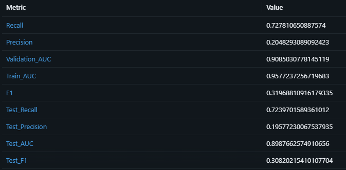

